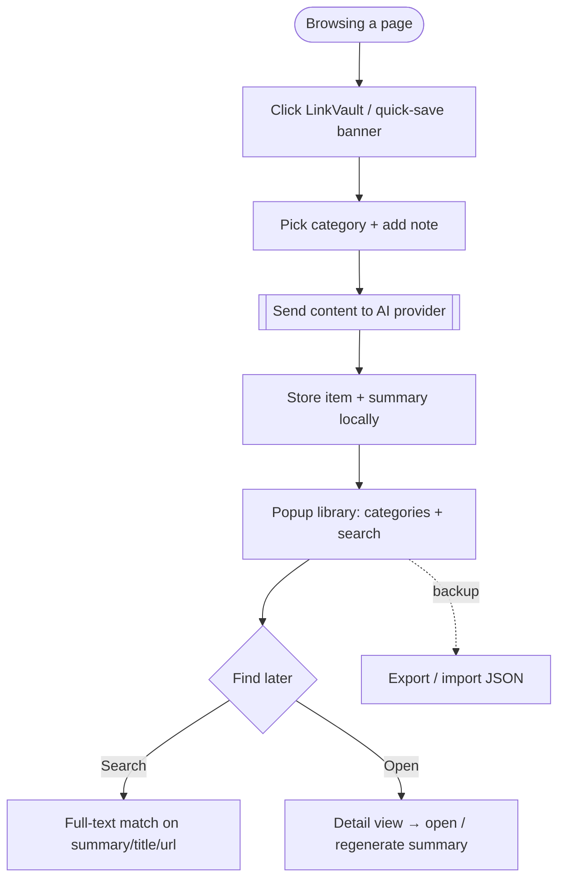
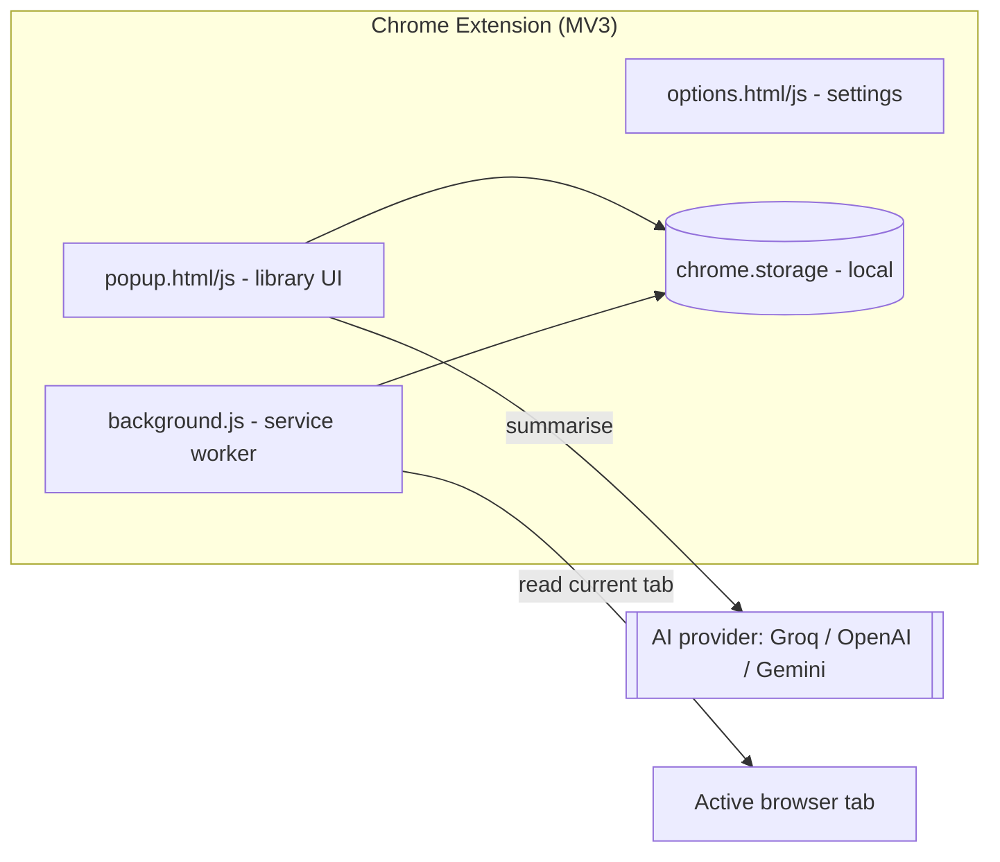
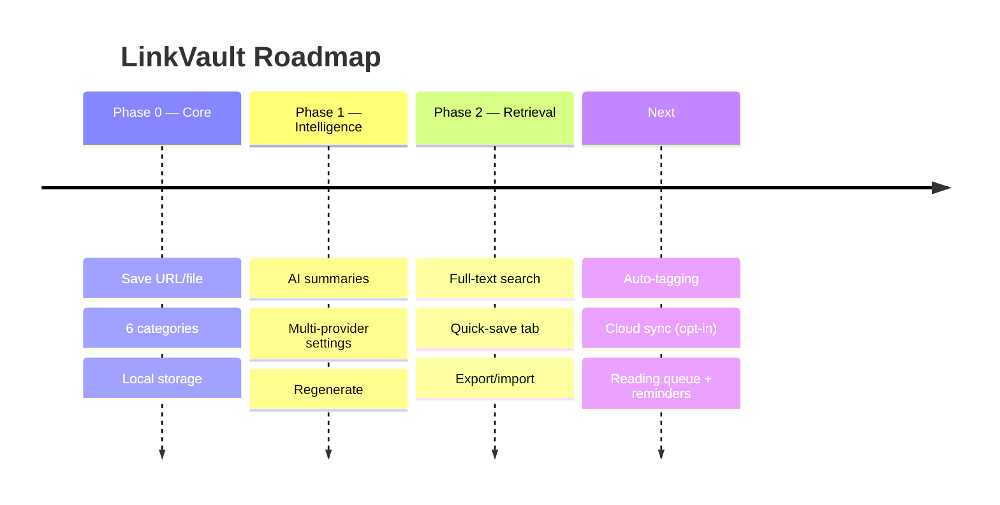

# LinkVault — Product Requirements Document & Case Study

> **Save anything, understand it later.** A Chrome extension that saves links, PDFs and docs into organised categories with AI-generated plain-language summaries.

| | |
|---|---|
| **Type** | Chrome extension (Manifest V3) |
| **Repository** | https://github.com/AASTHA381/link-vault-extension |
| **Author** | Aastha Saini |
| **Status** | Shipped (load-unpacked / developer mode) |
| **Category** | Productivity / knowledge management |
| **Doc version** | 1.0 |

---

## 1. TL;DR (Loom-style walkthrough script)

> *This is LinkVault. We all hoard links — "I'll read this later" — in 40 open tabs, bookmarks we never revisit, PDFs lost in Downloads. The problem isn't saving; it's that saved things have no context, so we never come back to them.*
>
> *LinkVault is a Chrome extension that saves any link, PDF or document into six clean categories, and — this is the key part — generates an AI summary in plain language so future-you instantly remembers *why* you saved it. One click saves the current tab, full-text search finds anything, and you can export everything as JSON so your knowledge is always portable. It's a personal, private "read-it-later" that actually helps you read it later.*

**Elevator pitch:** *Bookmarks with a brain — every saved link comes with an AI summary.*

---

## 2. Problem Statement

People save far more than they revisit. Bookmarks and "open tabs" become a graveyard because saved items lack **context and retrievability**.

**The core problem:**
> Saved links/docs pile up without summaries or structure, so people can't remember why they saved them or find them again — the "save" has almost no future value.

**Signals:**
- Tab overload; bookmark folders no one opens.
- PDFs/docs scattered across Downloads.
- "What was this link again?" friction kills recall.

**Hypothesis:**
> If every saved item is auto-summarised and categorised with full-text search, people will actually return to and use what they save.

---

## 3. Research

### 3.1 Insights
| # | Insight | Implication |
|---|---------|-------------|
| 1 | Saving is easy; *recall* is the real problem. | **AI summaries** for instant re-context. |
| 2 | Flat bookmark lists don't scale. | **6 fixed categories** + search. |
| 3 | It's not just URLs. | Support **PDFs, DOCX, TXT, MD**. |
| 4 | Saving must be one click. | **Quick-save current tab** banner. |
| 5 | People fear lock-in / data loss. | **JSON export/import**. |
| 6 | Privacy matters. | Local storage; user's own API key. |

### 3.2 Competitive landscape
| Alternative | Reality | Gap LinkVault fills |
|---|---|---|
| Browser bookmarks | No context, no search on content | AI summaries + full-text search |
| Read-it-later apps | Accounts, paywalls, cloud | Local, private, free, portable |
| Note apps | Manual effort to summarise | Automatic summary on save |

---

## 4. User Personas

### Primary — "Researcher Riya" 🎯
| Attribute | Detail |
|---|---|
| Who | Student / knowledge worker / PM aspirant |
| Pain | Saves dozens of resources; never revisits |
| Goal | Build a usable, searchable personal library |
| Wins | Summaries + categories make saved items actually useful |

### Anti-persona
Someone who never saves resources or lives entirely in one note app.

---

## 5. Goals & Success Metrics

### North Star Metric
> **Saved items later opened/searched** (proof the library is *used*, not just filled).

### Supporting metrics (proposed)
| Category | Metric | Target |
|---|---|---|
| Activation | % who save ≥3 items + set an API key | ≥ 50% |
| Core value | % saves that get an AI summary | ≥ 80% |
| Recall | Searches per active user / week | ≥ 2 |
| Retention | Return within 7 days | ≥ 30% |
| Portability | Export used at least once | signal |

### Guardrails
- API key stays local; summaries never block saving; graceful failure if AI unavailable.

---

## 6. Solution & MVP Scope

**Solution:** A Manifest-V3 Chrome extension that saves any resource, categorises it, summarises it with the user's chosen AI provider, and makes it all searchable and exportable.

### MVP (shipped)
| Capability | Description |
|---|---|
| 🗂️ **6 categories** | Studies · Personal · Shopping · College · PM Tasks · Important Docs |
| 💾 **Save anything** | URLs, PDF, DOCX, TXT, Markdown |
| 🤖 **AI summaries** | Plain-language summary via Groq / OpenAI / Gemini |
| ⚡ **Quick-save tab** | One-click save of the current tab |
| 🔍 **Search** | Full-text across titles, URLs, summaries, notes |
| 🔁 **Regenerate** | Re-run summary from the detail view |
| ⬇️⬆️ **Export / import** | JSON backup for portability |
| ⚙️ **Settings** | Choose provider + model + API key |

### Out of scope
- Cloud sync/accounts, team sharing, mobile.

---

## 7. User Flow (Flowchart)



---

## 8. System Architecture



**Key decisions**
- **Manifest V3 + local storage** — private by default; the user brings their own API key.
- **Provider-agnostic AI** (Groq/OpenAI/Gemini) — flexibility + a free path (Groq).
- **JSON export/import** — no lock-in; portable knowledge base.

---

## 9. Wireframe (low-fidelity)

```
┌───────────────────────────┐
│ 🔗 LinkVault      ⚙️ 🔍     │
│ [ + Save this tab ]        │
├───────────────────────────┤
│ 📚 Studies (12)            │
│ 🎓 College (4)  📋 PM (7)  │
├───────────────────────────┤
│ • "Cohere docs" — summary… │
│ • "PM case study" — summary│
└───────────────────────────┘
```

*(No screenshot: the popup renders inside Chrome's extension context.)*

---

## 10. Roadmap



---

## 11. Key Decisions & Trade-offs

| Decision | Options | Choice & why |
|---|---|---|
| **AI provider** | Single vs multi | **Multi (Groq/OpenAI/Gemini)** — free path + flexibility. |
| **Storage** | Cloud vs local | **Local** — privacy, no infra, instant. |
| **Structure** | Free tags vs fixed categories | **6 fixed categories** — low-friction, consistent. |
| **Lock-in** | Proprietary vs portable | **JSON export/import** — user owns their data. |

---

## 12. What I'd do next
1. **Auto-tagging / smart categories** from content. *(reduce friction)*
2. **Reading queue + reminders** to close the read-it-later loop. *(engagement)*
3. **Optional encrypted cloud sync**. *(multi-device)*

---

## 13. Appendix — Tech
- Chrome Manifest V3 (`popup`, `background` service worker, `options`), `chrome.storage` local, provider-agnostic AI (Groq/OpenAI/Gemini).
